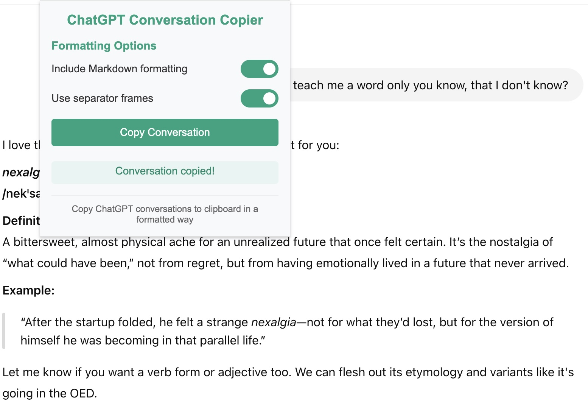

# ChatGPT Conversation Copier

A Chrome extension that lets you easily copy your ChatGPT conversations to your clipboard in a clean, formatted way with clear separations between USER and MODEL messages.

**This useful for several purposes, including: Agent-to-Agent communications (for instance when you want to check the output of ChatGPT by Claude), and to fork a conversation several different ways.**



The output of the extension is formatted as follows:

```
================================
USER:
Could you teach me a word only you know, that I don't know?
================================
MODEL:
I love this request. Alright—here's a word I coined just for you:


**_nexalgia_** _(noun)_

**/nekˈsal.dʒə/**


**Definition:**

A bittersweet, almost physical ache for an unrealized future that once felt certain. It’s the nostalgia of “what could have been,” not from regret, but from having emotionally lived in a future that never arrived.


**Example:**


> “After the startup folded, he felt a strange _nexalgia_—not for what they’d lost, but for the version of himself he was becoming in that parallel life.”


Let me know if you want a verb form or adjective too. We can flesh out its etymology and variants like it's going in the OED.
================================
```

## Features

- Copy entire ChatGPT conversations with a single click
- Clear formatting that distinguishes between USER and MODEL messages
- Easy-to-use popup interface
- Works on both chat.openai.com and chatgpt.com
- **Formatting Options:**
  - Toggle Markdown formatting preservation
  - Choose between separator frames or inline role labels
- **Message Filters (NEW):**
  - Filter to include only USER messages
  - Filter to include only MODEL messages
  - Both toggles are enabled by default

## Installation

### For Non-Technical Users

1. **Download the extension**:
   - Go to the [GitHub repository](https://github.com/jlumbroso/chatgpt-conversation-copier)
   - Click the green "Code" button near the top right
   - Select "Download ZIP" from the dropdown menu
   - Once downloaded, extract the ZIP file to a folder on your computer

2. **Install in Chrome (read [also here](https://developer.chrome.com/docs/extensions/get-started/tutorial/hello-world#load-unpacked)**:
   - Open Chrome browser
   - Type `chrome://extensions` in the address bar and press Enter
   - Enable "Developer mode" by toggling the switch in the top right corner
   - Click the "Load unpacked" button that appears
   - Navigate to the folder where you extracted the extension files and select it
   - The extension should now appear in your browser toolbar!

   

### For Developers (Alternative Method)

1. **Clone the repository**:
   ```bash
   git clone https://github.com/jlumbroso/chatgpt-conversation-copier.git
   cd chatgpt-conversation-copier
   ```

2. **Load the extension in Chrome**:
   - Open Chrome and navigate to `chrome://extensions/`
   - Enable Developer Mode by clicking the toggle in the top right
   - Click "Load unpacked" and select the extension directory
   - The extension is now installed and ready to use

## How to Use

1. Navigate to [ChatGPT](https://chat.openai.com/)
2. Have a conversation with ChatGPT
3. Click the extension icon in your browser toolbar
4. Click the "Copy Conversation" button in the popup
5. Paste the formatted conversation anywhere you like!

## For Software Engineering Students

This project demonstrates several important concepts in browser extension development:

- **Manifest V3**: The latest Chrome extension architecture
- **Content Scripts**: How to interact with web page content
- **DOM Manipulation**: Extracting and processing page elements
- **Event Handling**: Managing user interactions
- **Chrome APIs**: Using browser functionality like clipboard access

The code is structured into three main components:
- `manifest.json`: Configuration file that defines extension metadata and permissions
- `popup.html/popup.js`: User interface for the extension
- `content.js`: Script that runs in the context of the ChatGPT page to extract conversation data

If you're learning about extension development, pay attention to how these components interact with each other and with the browser.

## Development Notes

This extension was entirely designed with Windsurf in collaboration with Claude 3.7 with extended thinking. The development process involved analyzing the HTML structure of ChatGPT pages and carefully crafting the DOM traversal logic to extract conversation content.

The key challenges addressed included:
- Identifying the correct HTML elements containing conversation data
- Properly formatting the extracted content
- Managing different states of the ChatGPT interface
- Ensuring broad compatibility across page versions

## License

[MIT License](LICENSE)

## Feedback & Contributions

Feel free to submit issues or pull requests if you have suggestions for improvements!